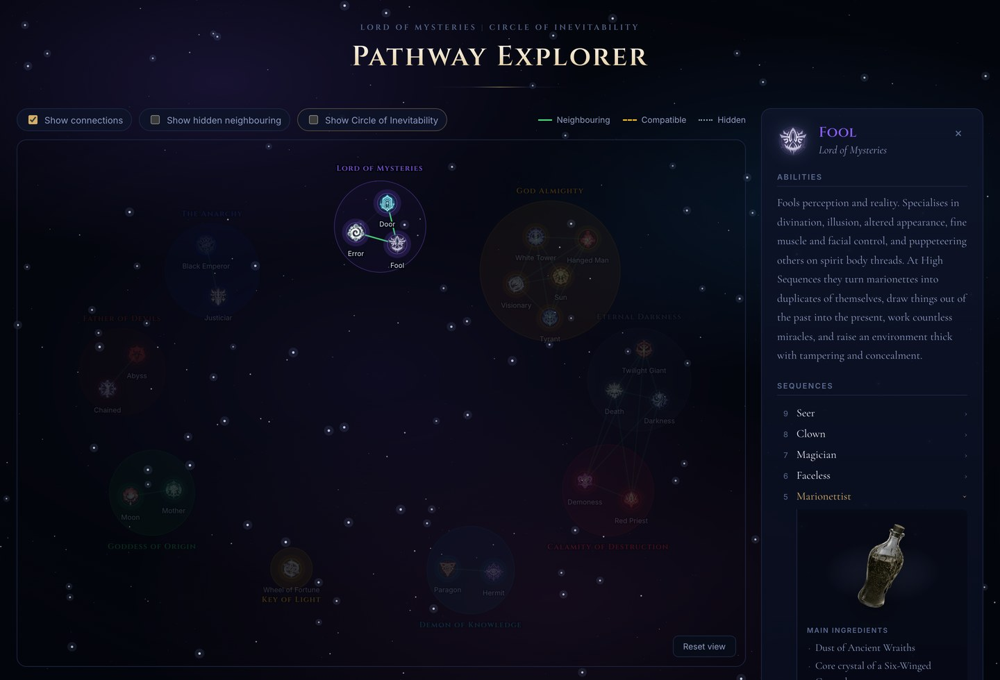

# Pathway Explorer

An interactive star map of the Beyonder pathways from *Lord of the Mysteries*.

Every pathway in the series is a ladder of ten Sequences, and every Sequence has
a potion behind it: main ingredients, supplementary ingredients, and an
advancement ritual that has to be performed to survive the climb. Pathways also
sit at varying distances from one another, which decides whether a Beyonder can
switch tracks and how much madness it costs.

That information is scattered across a very long novel. This puts it in one
place you can actually look at.



## What it shows

**32 pathways** arranged by the **19 Above the Sequence groups** that own them,
each with its sigil, drawn as a force-directed graph you can drag and zoom.

**Ten Sequences per pathway**, from Sequence 9 up to the Great Old One at
Sequence 0. Click any Sequence to see its potion artwork, its full formula, and
its ritual where one is recorded. Rituals only exist from Sequence 5 upward;
below that, the potion alone carries you.

**Proximity between pathways**, drawn as three kinds of line:

| | Meaning |
| --- | --- |
| **Neighbouring** | Same group, or two groups forming a bigger whole. Switching adds no madness. |
| **Compatible** | Different groups sharing some Symbols and Authorities. Switching costs madness, though not enough to prevent it. |
| **Hidden** | Genuine overlap that still cannot be switched between directly. These converge more readily than unrelated pathways. |

Connections start hidden so the map opens clean. Turn them on when you want to
trace routes.

## Spoilers

The ten outer-deity pathways are sequel material. They are hidden on every
visit, and **Show Circle of Inevitability** reveals them. Someone who has only
read the first book can explore the whole map without tripping over the second.

Hiding them is not cosmetic: their edges, group rings and switch targets are all
filtered out, so nothing leaks through a side panel.

## Running it

```sh
npm install
npm run dev
```

`npm run build` writes a static site to `dist/`.

## Where the data lives

| File | Holds |
| --- | --- |
| `src/data/pathways.js` | The 32 pathways and their Sequence names |
| `src/data/groups.js` | The 19 groups and the relations between them |
| `src/data/proximity.js` | Expands group relations down to pathway pairs |
| `src/data/descriptions.js` | What each pathway does |
| `src/data/advancement.js` | Formulas and rituals for the 22 standard pathways |
| `src/data/symbols.js` | Maps a pathway to its sigil |
| `src/data/solver.js` | Madness-minimising route finder, not yet wired to the UI |

Sigils are in `src/assets/symbols/`. Potion artwork is in `public/potions/`,
named `<pathway-id>-<sequence>.png`.

After editing `advancement.js`, check it still agrees with the pathway list:

```sh
node scripts/validate-advancement.mjs
```

It verifies every Sequence 9 through 0 is present, that names match
`pathways.js` by index, that no ritual is recorded below Sequence 5, and that no
stray keys crept in. It exits non-zero on any problem.

## Built with

React and Vite, with d3-force for the layout and d3-zoom for panning. The
starfield is painted once into a canvas rather than kept as DOM nodes, which is
what keeps the page cheap to render.

## Credit

*Lord of the Mysteries* and *Circle of Inevitability* were written by Cuttlefish
That Loves Diving. This is an unofficial fan project, built for reference, and
claims no ownership of the source material or the artwork.
